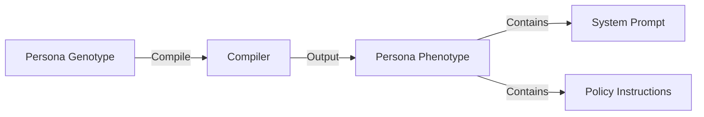

# Compiler: Genotype to Phenotype

**Module:** `snackPersona/compiler/compiler.py`

This module is responsible for translating the structured persona representation (Genotype) into the actual prompts and instructions used by the LLM (Phenotype).

## Data Flow

## Implementation Details

- **Input**: `PersonaGenotype` (Pydantic model from `utils.data_models`).
    - Contains structured fields like `name`, `age`, `core_values`, `communication_style`, etc.
- **Output**: `PersonaPhenotype`.
    - `system_prompt`: A directive defining the agent's identity and personality.
    - `policy_instructions`: Specific rules for interaction (e.g., "Ask clarifying questions").
- **Logic**: Uses f-string templates to inject genotype fields into natural language instructions.
