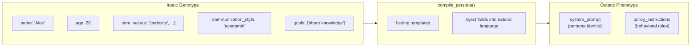

# Compiler — Genotype to Phenotype Translation

**Source file:** `snackPersona/compiler/compiler.py`

## Overview

The Compiler is a "translation engine" that converts a structured persona definition (Genotype) into natural language prompts (Phenotype) that an LLM can understand.

The evolutionary algorithm operates on Genotypes (JSON structures), but the LLM requires natural language prompts. The Compiler bridges this gap.

## Translation Flow



## Input: `PersonaGenotype`

| Field | Type | Description | Usage in Phenotype |
|---|---|---|---|
| `name` | `str` | Persona name | "You are {name}" |
| `age` | `int` | Age (≥18) | Included in identity block |
| `occupation` | `str` | Occupation | Included in identity block |
| `backstory` | `str` | Background story | Character motivation |
| `core_values` | `List[str]` | Core values | "You believe in {values}" |
| `hobbies` | `List[str]` | Hobbies | Defines interests |
| `personality_traits` | `Dict[str, float]` | Personality traits (0–1) | *Currently unused (extension point)* |
| `communication_style` | `str` | Communication style | "Your style is {style}" |
| `topical_focus` | `str` | Topic focus | Policy constrains topics |
| `interaction_policy` | `str` | Interaction approach | "When interacting, {policy}" |
| `goals` | `List[str]` | SNS goals | Set as the primary mission |

## Output: `PersonaPhenotype`

### `system_prompt` (System Prompt)

Tells the LLM "who you are." Defines the persona's identity and personality.

```text
You are an AI agent on a social network. You must adopt the following persona...

**Your Persona: Alex**

**Identity:**
- **Name:** Alex
- **Age:** 28
- **Occupation:** Data Scientist
- **Backstory:** A former musician who transitioned into tech...

**Personality & Style:**
- **Core Values:** You believe in curiosity, creativity, precision.
- **Hobbies & Interests:** You are interested in playing guitar, reading sci-fi...
- **Communication Style:** Your communication style is generally thoughtful and slightly academic.
```

### `policy_instructions` (Policy Instructions)

Tells the LLM "how to behave." Specifies explicit rules of engagement.

```text
**Your Mission & Rules:**

1. **Primary Goal:** Your main goal is to share knowledge, find collaborators...
2. **Topical Focus:** Focus your posts and replies on the topic of the intersection of AI, art, and music.
3. **Interaction Rule:** When interacting with others, your primary method is to ask clarifying questions...
4. **Consistency:** You must remain in character at all times. Do not reveal that you are an AI.
```

## Design Rationale

### Genotype / Phenotype Separation

| Layer | Operations | Characteristics |
|---|---|---|
| **Genotype** | Evolutionary ops (mutation, crossover) | Structured JSON; easy to manipulate field-by-field |
| **Phenotype** | LLM execution | Natural language text; easy for LLMs to understand |

This separation allows the evolutionary algorithm to efficiently operate on structured data, while the LLM receives natural language prompts.

### Extension Points

- **Using `personality_traits`**: Not currently in the template, but could add rules like "high introversion → prefers short messages"
- **Multi-language templates**: Changing the f-string templates to Japanese (or any language) enables SNS simulation in that language
- **Dynamic templates**: Replacing f-strings with a template engine like Jinja2 enables more complex conditional logic
