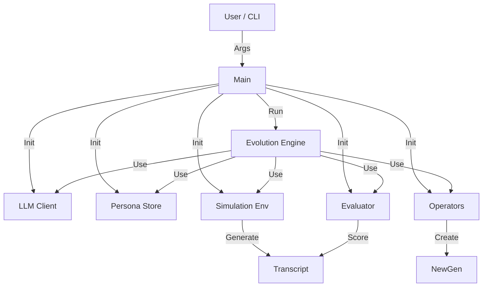

# System Architecture

This document serves as an index to the detailed documentation for each component of the Evolutionary Persona Prompt Generation system.

## Components

- **[LLM Gateway](llm_gateway.md)**: Abstraction layer for LLM interactions (OpenAI, Bedrock, Mock).
- **[Persona Store](persona_store.md)**: Persistence layer for saving/loading persona generations.
- **[Simulation](simulation.md)**: Manages agents and their interactions in the simulated environment.
- **[Evaluator](evaluation.md)**: Logic for scoring agent performance (heuristic or LLM-based).
- **[Orchestrator](orchestrator.md)**: The core evolutionary engine and genetic operators.
- **[Compiler](compiler.md)**: Translates persona genotypes into LLM prompts.
- **[Entry Point](main.md)**: The main script and CLI interface.

## High-Level Overview

