# System Architecture — Evolutionary Persona Prompt Generation

This document describes the overall architecture of a system that evolutionarily generates and optimizes persona prompts for an AI-only SNS.

## Purpose

- **Goal**: Automatically generate diverse and engaging AI personas, improving quality generation by generation using evolutionary algorithms
- **Approach**: Apply genetic algorithm (GA) concepts to prompt engineering
- **Output**: Persona populations per generation (JSON) and simulation conversation logs

## Full Architecture Diagram


## Data Flow (Single Generation)

```mermaid
sequenceDiagram
    participant Main as main.py
    participant Engine as EvolutionEngine
    participant Store as PersonaStore
    participant Env as SimulationEnvironment
    participant Agent as SimulationAgent
    participant Compiler as compile_persona()
    participant LLM as LLMClient
    participant Eval as Evaluator
    participant Ops as Operators

    Main->>Engine: run_evolution_loop()
    
    loop Each Generation
        Note over Engine: Step 1: Simulation
        Engine->>Env: run_episode(rounds, topic)
        Env->>Agent: generate_post(topic)
        Agent->>Compiler: compile_persona(genotype)
        Compiler-->>Agent: PersonaPhenotype
        Agent->>LLM: generate_text(system_prompt, user_prompt)
        LLM-->>Agent: Post text
        Agent-->>Env: Post
        Env->>Agent: generate_reply(post, author)
        Agent->>LLM: generate_text(system_prompt, reply_prompt)
        LLM-->>Agent: Reply text
        Agent-->>Env: Reply
        Env-->>Engine: Transcript (conversation log)

        Note over Engine: Step 2: Evaluation
        Engine->>Eval: evaluate(genotype, transcript)
        Eval-->>Engine: FitnessScores

        Note over Engine: Step 3: Save
        Engine->>Store: save_generation(gen_id, population)

        Note over Engine: Step 4: Selection & Reproduction
        Engine->>Engine: Elite selection (keep top N)
        Engine->>Ops: crossover(parent_a, parent_b)
        Ops-->>Engine: Child persona
        Engine->>Ops: mutate(child)
        Ops-->>Engine: Mutated persona
    end
```



## Data Model Overview

| Model | File | Role |
|---|---|---|
| `PersonaGenotype` | `utils/data_models.py` | The "genes" of a persona — the target of evolutionary operations |
| `PersonaPhenotype` | `utils/data_models.py` | Compiled system prompt ready for LLM use |
| `FitnessScores` | `utils/data_models.py` | Multi-dimensional evaluation scores (0.0–1.0) |
| `Individual` | `utils/data_models.py` | Bundles Genotype + Phenotype + Scores |

## Component Index

See each component's directory for detailed documentation:

| Component | Documentation | Summary |
|---|---|---|
| LLM Gateway | [llm_gateway.md](../llm/llm_gateway.md) | LLM API abstraction layer |
| Compiler | [compiler.md](../compiler/compiler.md) | Genotype → Phenotype translation |
| Persona Store | [persona_store.md](../persona_store/persona_store.md) | Generation data persistence |
| Simulation | [simulation.md](../simulation/simulation.md) | Agent-to-agent SNS simulation |
| Evaluation | [evaluation.md](../evaluation/evaluation.md) | Performance scoring |
| Orchestrator | [orchestrator.md](../orchestrator/orchestrator.md) | Evolutionary loop & genetic operations |
| Main | [main.md](../main.md) | CLI entry point |

## How to Run

```bash
# Run 2 generations of 4 personas with Mock LLM
python3 snackPersona/main.py --generations 2 --pop_size 4 --llm mock --store_dir persona_data

# Using OpenAI API
export OPENAI_API_KEY="sk-..."
python3 snackPersona/main.py --generations 3 --pop_size 6 --llm openai

# Using AWS Bedrock
python3 snackPersona/main.py --generations 3 --pop_size 6 --llm bedrock
```

## Extension Points

- **New LLM backends**: Subclass `LLMClient` and implement `generate_text`
- **New evaluation metrics**: Subclass `Evaluator`, add fields to `FitnessScores`
- **New genetic operators**: Subclass `MutationOperator` / `CrossoverOperator`
- **Compiler customization**: Modify the f-string templates in `compile_persona()`
