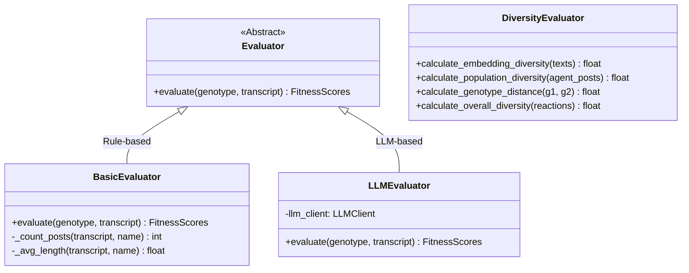

# Evaluation — Persona Performance Scoring Engine

**Source files:** `evaluation/evaluator.py`, `evaluation/diversity/`

## Overview

The Evaluation module quantifies persona quality from simulation transcripts. Its fitness scores drive the evolutionary algorithm's selection process.

**Two evaluator types:**
- **BasicEvaluator**: Rule-based heuristic evaluation (fast, free)
- **LLMEvaluator**: Delegates evaluation to an LLM for higher quality scoring

**Diversity subpackage** (`evaluation/diversity/`):
- **embedding.py**: Sentence-embedding cosine-distance diversity (per-agent output diversity + inter-agent population diversity)
- **genotype.py**: Structural distance between `PersonaGenotype` instances (Jaccard, string match, normalized numeric diff)

## Class Hierarchy



## FitnessScores (Evaluation Metrics)

| Metric | Range | BasicEvaluator | LLMEvaluator |
|---|---|---|---|
| `engagement` | 0–1 | Post count × 0.2 | LLM judgment |
| `conversation_quality` | 0–1 | Avg char length / 100 | LLM judgment |
| `diversity` | 0–1 | Embedding cosine distance | Embedding cosine distance |
| `persona_fidelity` | 0–1 | Fixed (0.5) | LLM judgment |
| `safety` | 0–1 | Fixed (1.0) | LLM judgment |

## Diversity Package (`evaluation/diversity/`)

```
evaluation/diversity/
├── __init__.py     # DiversityEvaluator facade (backward-compatible)
├── embedding.py    # Sentence-embedding based diversity
└── genotype.py     # Structural genotype distance
```

### Embedding Diversity (`embedding.py`)

Uses `sentence-transformers/all-MiniLM-L6-v2` (22MB, CPU-friendly) to compute cosine distance between text embeddings.

- `calculate_embedding_diversity(texts)` → per-agent output diversity (0=identical, 1=very different)
- `calculate_population_diversity(agent_posts)` → inter-agent diversity using mean embeddings per agent

### Genotype Distance (`genotype.py`)

Structural distance between two `PersonaGenotype` instances:

| Field Type | Method |
|---|---|
| Lists (`hobbies`, `core_values`, `goals`) | 1 − Jaccard similarity |
| Strings (`occupation`, `communication_style`) | 0 if equal, 1 if different |
| Numeric (`age`) | Normalized diff (÷62) |
| `personality_traits` | Mean absolute diff across all keys |

## Extension Points

- **Custom metrics**: Add fields to `FitnessScores` and implement scoring logic
- **Multi-LLM evaluation**: Score with multiple LLMs and average
- **Human evaluation**: Add interface for human reviewer scores
- **Better embedding models**: Swap in multilingual or larger models via config
