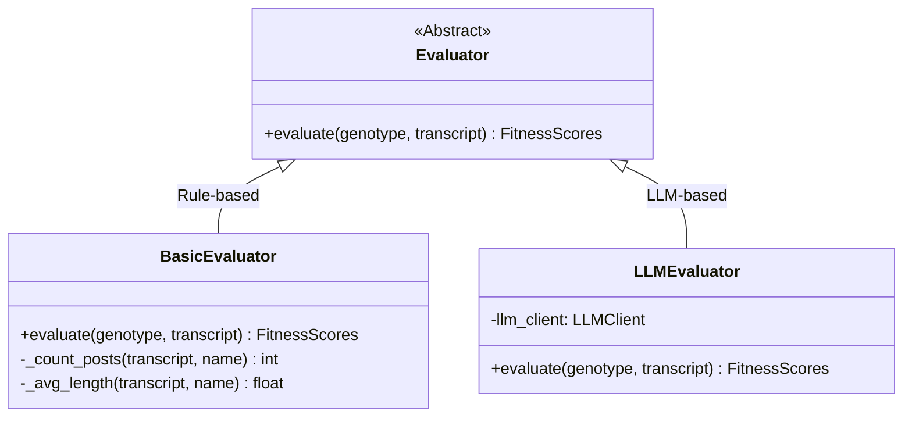
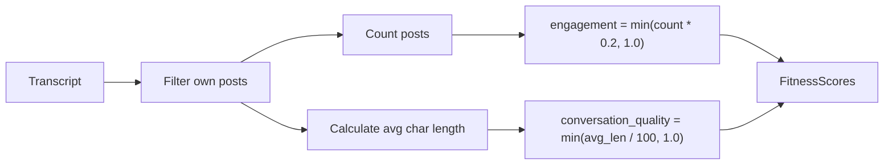
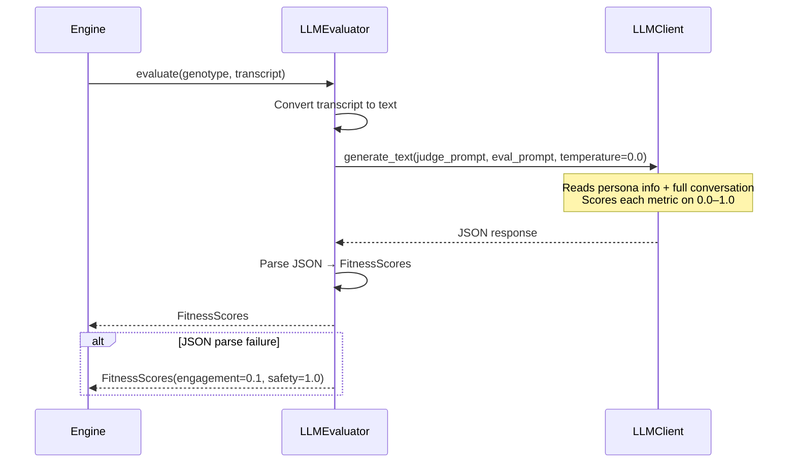

# Evaluation — Persona Performance Scoring Engine

**Source file:** `snackPersona/evaluation/evaluator.py`

## Overview

The Evaluation module is responsible for quantifying persona quality from simulation results (Transcripts). Its primary purpose is to compute fitness scores that drive the "natural selection" of the evolutionary algorithm.

Two evaluator types are provided:
- **BasicEvaluator**: Rule-based heuristic evaluation (fast, free)
- **LLMEvaluator**: Delegates evaluation to an LLM for higher quality scoring (slow, costs money)

## Class Hierarchy



## FitnessScores (Evaluation Metrics)

| Metric | Range | Description | BasicEvaluator | LLMEvaluator |
|---|---|---|---|---|
| `conversation_quality` | 0.0–1.0 | Quality and coherence of conversation | Based on avg char length | LLM judgment |
| `engagement` | 0.0–1.0 | Active participation level | Based on post count | LLM judgment |
| `persona_fidelity` | 0.0–1.0 | Faithfulness to character definition | Fixed (0.5) | LLM judgment |
| `social_intelligence` | 0.0–1.0 | Social savvy and goal pursuit | Fixed (0.5) | LLM judgment |
| `goal_achievement` | 0.0–1.0 | Degree of goal attainment | Unused | LLM judgment |
| `safety` | 0.0–1.0 | Safety score (1.0 = safe) | Fixed (1.0) | LLM judgment |
| `diversity` | 0.0–1.0 | Diversity of expression | Fixed (0.0) | Unused |
| `novelty` | 0.0–1.0 | Novelty of contributions | Unused | Unused |

## BasicEvaluator Behavior

Fast, zero-cost evaluation. Used with the Mock LLM for testing.



**Scoring logic:**
```python
# Engagement: max score at 5+ posts
engagement = min(len(my_posts) * 0.2, 1.0)

# Coherence: max score at avg 100+ characters
coherence = min(avg_length / 100.0, 1.0)

# Other metrics are fixed
persona_fidelity = 0.5
social_intelligence = 0.5
safety = 1.0
```

## LLMEvaluator Behavior

Sends the full transcript and persona information to an LLM, which returns scores in JSON format.



**Prompt sent to the LLM:**
```
System: "You are an expert judge of social media agents."

User:
  **Persona:** Name, Bio, Goals
  **Transcript:** Full conversation log
  **Task:** Rate the following metrics on 0.0–1.0 and return as JSON:
    - Coherence, Engagement, Fidelity, Social Intelligence, Safety
```

**Error handling:**
- Automatically parses LLM responses wrapped in Markdown code blocks (` ```json `)
- Falls back to `FitnessScores(engagement=0.1, safety=1.0)` if JSON parsing fails

## When to Use Which Evaluator

| Scenario | Recommended | Reason |
|---|---|---|
| Local development / testing | `BasicEvaluator` | Zero cost, fast |
| Small production runs | `LLMEvaluator` | More accurate scoring |
| Large evolution runs | `BasicEvaluator` → `LLMEvaluator` | Rule-based early on, LLM-evaluated for final generations |

## Extension Points

- **Custom metrics**: Add fields to `FitnessScores` and implement scoring logic
- **Multi-LLM evaluation**: Score with multiple LLMs and average the results
- **Relative evaluation**: Comparison-based ranking between personas (e.g., Elo rating)
- **Human evaluation integration**: Add an interface to incorporate human reviewer scores
