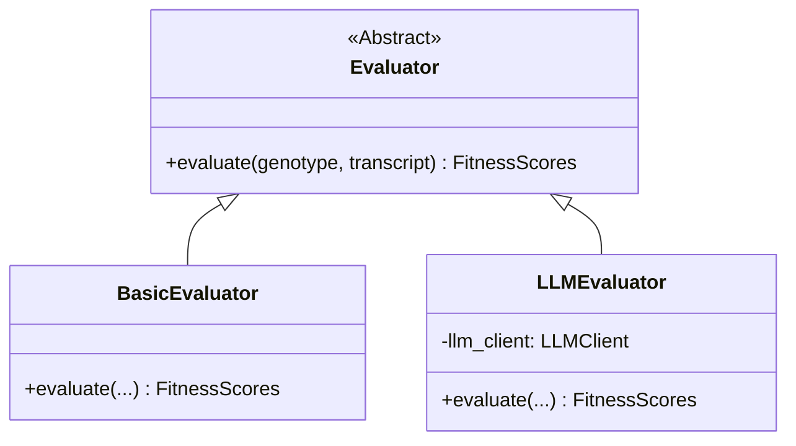

# Evaluator Engine

**Module:** `snackPersona/evaluation/evaluator.py`

This module defines the evaluation logic for assessing persona performance. It supports both rule-based (basic) and LLM-based evaluation.

## Class Diagram

## Implementation Details

- **Evaluator (Abstract Base Class)**: Defines the `evaluate` method.
- **FitnessScores**: A data model representing the multi-dimensional score of an agent (coherence, engagement, fidelity, safety, etc.).
- **BasicEvaluator**: A fast, heuristic-based scorer for testing. Uses metrics like word count or participation frequency.
- **LLMEvaluator**: Uses an LLM to read the entire transcript and assign scores based on a detailed rubric. It is more accurate but slower and costly.
