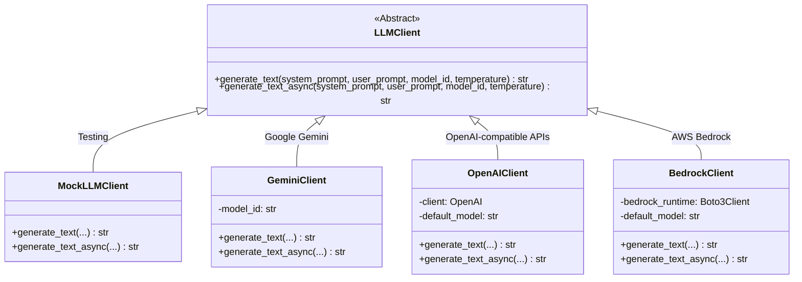

# LLM Client Gateway

**Source files:** `snackPersona/llm/llm_client.py`, `snackPersona/llm/gemini_client.py`, `snackPersona/llm/llm_factory.py`

## Overview

This module is a gateway that abstracts interactions with LLM (Large Language Model) backends. It provides a unified interface so the rest of the application doesn't depend on any specific LLM provider.

All clients support both **synchronous** and **asynchronous** text generation via `generate_text()` and `generate_text_async()`.

## Why Abstraction Matters

- **Cost management**: Use `MockLLMClient` during development/testing to incur zero API costs
- **Provider switching**: Migrating from Gemini to OpenAI requires changing only the `--llm` preset flag
- **Local model support**: `OpenAIClient` can connect to local models (vLLM, Ollama, LM Studio) by simply changing the `base_url`

## Class Hierarchy



## Preset System (`llm_factory.py`)

Select a backend via `--llm <preset>`:

| Preset | Backend | Model |
|---|---|---|
| `mock` | MockLLMClient | — |
| `gemini-flash` | GeminiClient | `gemini-2.0-flash` |
| `gemini-3-flash` | GeminiClient | `gemini-3-flash-preview` |
| `openai-gpt4o` | OpenAIClient | `gpt-4o` |
| `bedrock-claude` | BedrockClient | `anthropic.claude-3-sonnet-*` |

Defined in `config/llm_presets.json`.

## MockLLMClient — Keyword-Based Responses

| Keyword(s) | Response |
|---|---|
| `"nickname"` + `"occupation"` | Creative nickname from attributes |
| `"persona"` + `"json"` + `"diverse"` | JSON array of seed personas |
| `"trending"` + `"topic"` + `"json"` | JSON array of discussion topics |
| `"would you reply"` + `"yes"/"no"` | Random `"yes"` / `"no"` |
| `"post"` + `"draft"` | Random post text |
| `"reply"` | Random reply text |
| `"evaluate"` / `"score"` / `"rate"` | JSON fitness scores |
| `"mutate"` | Mutated persona JSON |
| Other | Generic fallback response |

## GeminiClient

Uses the Google Generative AI SDK (`google-genai`) with built-in rate limiting.

```python
# Requires GEMINI_API_KEY environment variable
client = GeminiClient(model_id="gemini-3-flash-preview")
```

## Dependencies

| Package | Required When | Purpose |
|---|---|---|
| `google-genai` | Using `GeminiClient` | Gemini API client |
| `openai` | Using `OpenAIClient` | OpenAI API client |
| `boto3` | Using `BedrockClient` | AWS SDK |

> **Note**: Backend packages are lazily imported, so packages for unused backends are not required.

## Adding a New Backend

```python
class MyCustomClient(LLMClient):
    def __init__(self, endpoint: str):
        self.endpoint = endpoint

    def generate_text(self, system_prompt, user_prompt, model_id=None, temperature=0.7):
        response = my_api_call(self.endpoint, system_prompt, user_prompt)
        return response.text

    async def generate_text_async(self, system_prompt, user_prompt, model_id=None, temperature=0.7):
        return self.generate_text(system_prompt, user_prompt, model_id, temperature)
```
