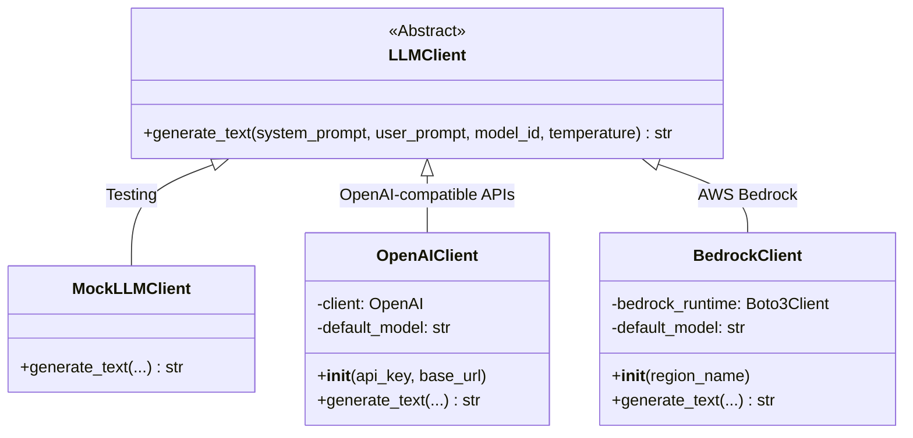

# LLM Client Gateway

**Source file:** `snackPersona/llm/llm_client.py`

## Overview

This module is a gateway that abstracts interactions with LLM (Large Language Model) backends. It provides a unified interface so the rest of the application doesn't depend on any specific LLM provider.

## Why Abstraction Matters

- **Cost management**: Use `MockLLMClient` during development/testing to incur zero API costs
- **Provider switching**: Migrating from OpenAI to AWS Bedrock requires changing only a single line of code
- **Local model support**: `OpenAIClient` can connect to local models (vLLM, Ollama, LM Studio) by simply changing the `base_url`

## Class Hierarchy



## Class Details

### `LLMClient` (Abstract Base Class)

Defines the interface that all clients must implement.

```python
@abstractmethod
def generate_text(
    self,
    system_prompt: str,     # Agent's persona definition
    user_prompt: str,       # Specific instructions (create post, reply, etc.)
    model_id: Optional[str] = None,  # Model ID (uses default if omitted)
    temperature: float = 0.7        # Generation diversity
) -> str:
```

### `MockLLMClient`

A dummy client for testing without API calls. Returns different responses based on keywords in the prompt:

| Keyword | Response |
|---|---|
| `"post"` | Dummy post-like text |
| `"reply"` | Dummy reply-like text |
| `"evaluate"` / `"score"` | JSON-formatted scores |
| `"mutate"` | Mutated persona JSON |
| Other | `"Generic Mock LLM Response."` |

### `OpenAIClient`

Uses the OpenAI Chat Completions API. Also compatible with vLLM / Ollama / LM Studio endpoints.

```python
# Initialization example
client = OpenAIClient(
    api_key="sk-...",          # or set OPENAI_API_KEY env var
    base_url="http://localhost:8080/v1"  # or set OPENAI_BASE_URL env var
)
```

**Required environment variables:**

| Variable | Description | Default |
|---|---|---|
| `OPENAI_API_KEY` | API key | None (required) |
| `OPENAI_BASE_URL` | Endpoint URL | Official OpenAI endpoint |

### `BedrockClient`

Uses the AWS Bedrock Converse API. Requires IAM authentication.

```python
# Initialization example
client = BedrockClient(region_name="us-east-1")
# Default model: anthropic.claude-3-sonnet-20240229-v1:0
```

## Dependencies

| Package | Required When | Purpose |
|---|---|---|
| `openai` | Using `OpenAIClient` | OpenAI API client |
| `boto3` | Using `BedrockClient` | AWS SDK |

> **Note**: Both `openai` and `boto3` are lazily imported via `try/except`, so packages for unused backends are not required.

## Adding a New Backend

```python
class MyCustomClient(LLMClient):
    def __init__(self, endpoint: str):
        self.endpoint = endpoint

    def generate_text(self, system_prompt, user_prompt, model_id=None, temperature=0.7):
        # Implement your custom API call logic here
        response = my_api_call(self.endpoint, system_prompt, user_prompt)
        return response.text
```
