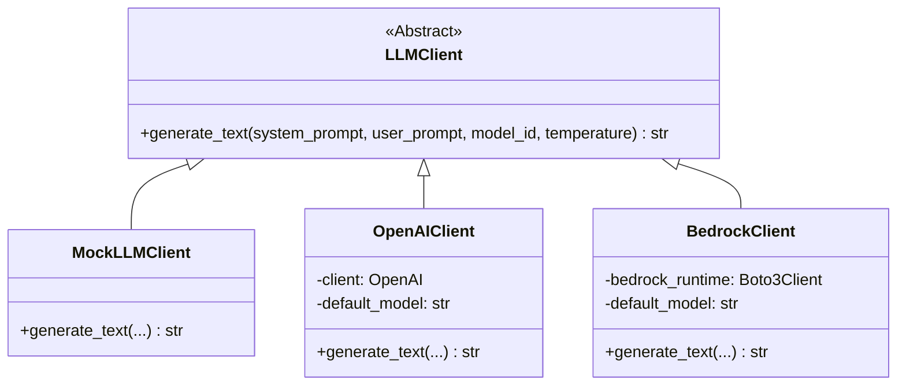

# LLM Client Gateway

**Module:** `snackPersona/llm/llm_client.py`

This module provides an abstraction layer for interacting with various Large Language Model (LLM) backends. It allows the rest of the application to be agnostic to the specific LLM provider being used.

## Class Diagram

## Implementation Details

- **LLMClient (Abstract Base Class)**: Defines the `generate_text` interface that all clients must implement.
- **MockLLMClient**: A dummy implementation used for testing and development to avoid API costs. It returns simple, canned responses based on keywords in the prompt.
- **OpenAIClient**: Uses the `openai` Python library to connect to OpenAI-compatible APIs. It supports configuring the base URL and API key via environment variables.
- **BedrockClient**: Uses `boto3` to connect to Amazon Bedrock. It defaults to using the Converse API pattern for modern chat models.
