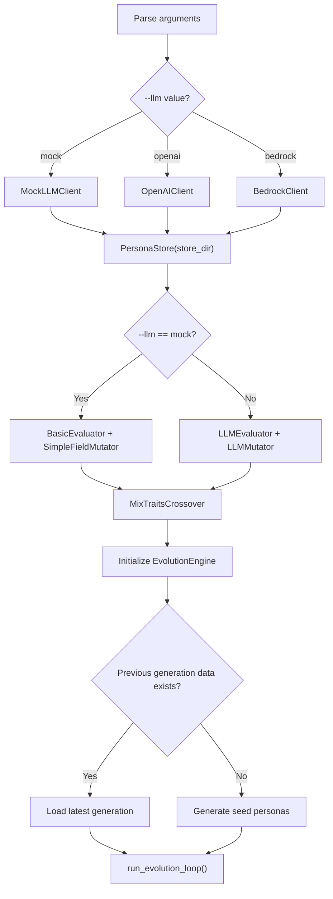

# Main — CLI Entry Point

**Source file:** `snackPersona/main.py`

## Overview

`main.py` is the system's entry point. It parses command-line arguments, initializes all components, and runs the evolution loop.

## How to Run

```bash
# Basic usage (test run with Mock LLM)
python3 snackPersona/main.py --generations 2 --pop_size 4 --llm mock

# Using OpenAI API
export OPENAI_API_KEY="sk-..."
python3 snackPersona/main.py --generations 3 --pop_size 6 --llm openai

# Using AWS Bedrock
python3 snackPersona/main.py --generations 3 --pop_size 6 --llm bedrock

# Specify output directory
python3 snackPersona/main.py --store_dir my_experiment_01
```

## CLI Options

| Option | Type | Default | Description |
|---|---|---|---|
| `--generations` | `int` | `3` | Number of generations to evolve |
| `--pop_size` | `int` | `4` | Population size (number of personas) |
| `--llm` | `str` | `mock` | LLM backend (`mock`, `openai`, `bedrock`) |
| `--store_dir` | `str` | `persona_data` | Directory for storing generation data |

## Initialization Flow



## Automatic Component Selection

The `--llm` option automatically determines which related components to use:

| `--llm` | LLMClient | Evaluator | MutationOperator |
|---|---|---|---|
| `mock` | `MockLLMClient` | `BasicEvaluator` | `SimpleFieldMutator` |
| `openai` | `OpenAIClient` | `LLMEvaluator` | `LLMMutator` |
| `bedrock` | `BedrockClient` | `LLMEvaluator` | `LLMMutator` |

> **Note**: `CrossoverOperator` is always `MixTraitsCrossover` regardless of the LLM choice. `elite_count` is automatically set to `pop_size // 4` (minimum 1).

## Seed Personas

The initial population consists of 4 seed personas defined in `create_seed_population()`:

| Name | Age | Occupation | Style | Focus |
|---|---|---|---|---|
| **Alice** | 25 | Digital Artist | enthusiastic and visual | digital art trends |
| **Bob** | 35 | Software Engineer | concise and technical | programming best practices |
| **Charlie** | 22 | Student | inquisitive and verbose | ethics of AI |
| **Dana** | 40 | Journalist | direct and probing | current events |

If `--pop_size` exceeds the seed count (4), deep copies of existing seeds are added until the population size is reached.

## Resuming from Existing Data

If the `store_dir` contains previous generation data, the system automatically resumes from the latest generation:

```
persona_data/
├── gen_0.json   ← Previous run
├── gen_1.json   ← Previous run
└── gen_2.json   ← Resume from here (this population becomes the initial population)
```

## Sample Output

Running the system produces output like:

```
Using Mock LLM Client...
Initializing new seed population...
Starting Evolution Loop...
--- Generation 0 ---
Agent Alice: Engagement=0.20, Coherence=0.47
Agent Bob: Engagement=0.00, Coherence=0.00
Agent Charlie: Engagement=0.20, Coherence=0.47
Agent Dana: Engagement=0.00, Coherence=0.00
--- Generation 1 ---
Agent Alice: Engagement=0.20, Coherence=0.47
Agent Alice: Engagement=0.20, Coherence=0.47
...
Evolution Complete!
```

Evolution results are saved to the `--store_dir` directory as `gen_0.json`, `gen_1.json`, etc.
