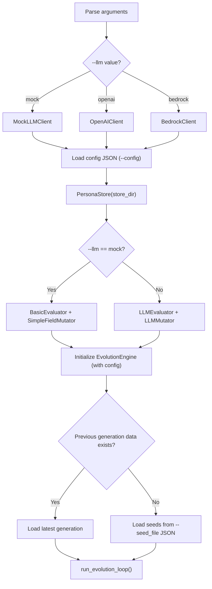

# Main — CLI Entry Point

**Source file:** `snackPersona/main.py`

## Overview

`main.py` is the system's entry point. It parses command-line arguments, loads configuration from JSON files, initializes all components, and runs the evolution loop.

## How to Run

```bash
# Basic usage (test run with Mock LLM)
python3 snackPersona/main.py --generations 2 --pop_size 4 --llm mock

# Full example with JSON config and custom seeds
python3 snackPersona/main.py --generations 3 --pop_size 6 --llm mock \
  --config snackPersona/config/evolution_config.json \
  --seed_file snackPersona/config/seed_personas.json

# Using OpenAI API
export OPENAI_API_KEY="sk-..."
python3 snackPersona/main.py --generations 3 --pop_size 6 --llm openai

# Using AWS Bedrock
python3 snackPersona/main.py --generations 3 --pop_size 6 --llm bedrock

# Specify output directory
python3 snackPersona/main.py --store_dir my_experiment_01

# Using media dataset for reaction-based simulation
python3 snackPersona/main.py --llm mock --media_dataset sample_media_dataset.json
```

## CLI Options

| Option | Type | Default | Description |
|---|---|---|---|
| `--generations` | `int` | `3` | Number of generations to evolve |
| `--pop_size` | `int` | `4` | Population size |
| `--llm` | `str` | `mock` | LLM backend (`mock`, `openai`, `bedrock`) |
| `--store_dir` | `str` | `persona_data` | Directory for generation data and logs |
| `--media_dataset` | `str` | `None` | Path to JSON media items file |
| `--seed_file` | `str` | `config/seed_personas.json` | Path to JSON file with seed personas |
| `--config` | `str` | `None` | Path to JSON evolution config (fitness weights, niching, etc.) |

## Initialization Flow



## Configuration Files

### `config/seed_personas.json`

8 seed personas (Alice, Bob, Charlie, Dana, Eve, Frank, Grace, Hiro). Each entry is a full `PersonaGenotype` object.

### `config/evolution_config.json`

Tunable parameters for the evolution engine:

```json
{
  "fitness_weights": { "engagement": 0.35, "conversation_quality": 0.35, "diversity": 0.20, "persona_fidelity": 0.10 },
  "niching": { "sigma": 0.5, "alpha": 1.0 },
  "simulation": { "group_size": 4, "reply_rounds": 3, "mutation_rate": 0.2 }
}
```

### `config/mutation_pools.json`

Value pools for `SimpleFieldMutator`: hobbies, core_values, communication_styles, topical_focuses, interaction_policies, occupations, life_events.

## Automatic Component Selection

| `--llm` | LLMClient | Evaluator | MutationOperator |
|---|---|---|---|
| `mock` | `MockLLMClient` | `BasicEvaluator` | `SimpleFieldMutator` |
| `openai` | `OpenAIClient` | `LLMEvaluator` | `LLMMutator` |
| `bedrock` | `BedrockClient` | `LLMEvaluator` | `LLMMutator` |

## Output

Evolution results are saved to `--store_dir`:

```
persona_data/
├── gen_0.json                  # Generation 0 population
├── gen_1.json                  # Generation 1 population
└── generation_stats.jsonl      # Per-generation fitness stats (machine-readable)
```

### Sample Console Output

```
[23:58:51] INFO  Using Mock LLM Client
[23:58:51] INFO  Loaded 8 seed personas from config/seed_personas.json
[23:58:51] INFO  Loaded config from config/evolution_config.json
[23:58:51] INFO  Population initialized with 6 individuals
[23:58:51] INFO  Starting Evolution Loop
[23:58:51] INFO  ========================================
[23:58:51] INFO  Generation 0
[23:58:51] INFO  ========================================
[23:58:51] INFO  [Episode] Phase 1: 4 agents posting on 'AI Technology'
[23:58:51] INFO  [Episode] Phase 2, Round 1/3
[23:58:51] INFO  Gen 0 | PopDiv=0.260 | Fitness mean=0.388 max=0.388 min=0.388
[23:58:51] INFO    Alice: Eng=0.80 Qual=0.17 Div=0.00 Fid=0.50 | Raw=0.388 Shared=0.388
...
[23:58:51] INFO  Evolution Complete!
[23:58:51] INFO  Stats saved to persona_data/generation_stats.jsonl
```
