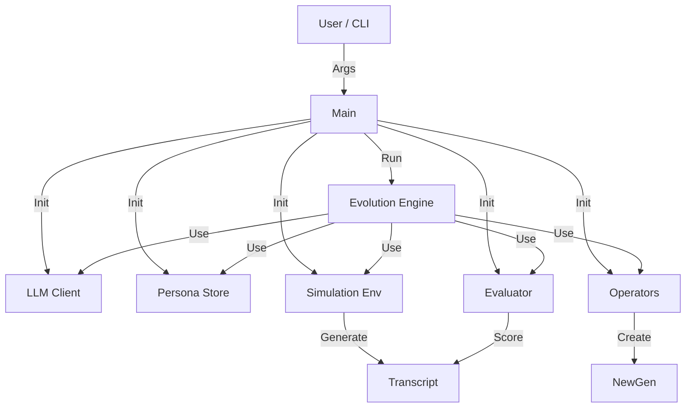

# Main Application Entry Point

**Module:** `snackPersona/main.py`

This script serves as the main entry point to run the application, orchestrating the creation and initialization of all core components.

## System Overview



## Usage

```bash
python3 snackPersona/main.py [options]
```

### Options
- `--generations X`: Number of generations to evolve (default: 3).
- `--pop_size Y`: Size of the persona population (default: 4).
- `--llm [mock|openai|bedrock]`: LLM backend to use (default: mock).
- `--store_dir [path/to/dir]`: Directory to store generated JSON (default: persona_data).

## Initialization Flow
1.  Parse arguments.
2.  Initialize the configured `LLMClient`.
3.  Initialize `PersonaStore` with target directory.
4.  Initialize `Evaluator` and `Operators` based on LLM choice.
5.  Load existing population or create new seed.
6.  Start `EvolutionEngine`.
