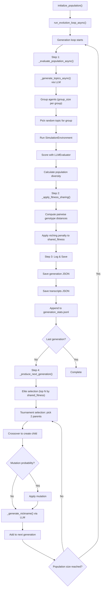

# Evolution Orchestrator — Engine & Genetic Operators

**Source files:** `orchestrator/engine.py`, `orchestrator/operators.py`

## Overview

The Orchestrator is the heart of the evolutionary algorithm:

- **`engine.py`**: `EvolutionEngine` — controls the async evolution loop with LLM-driven topic generation, nickname generation, fitness sharing, transcript logging, and structured logging
- **`operators.py`**: Mutation and Crossover genetic operators with value-pool-based mutation

## EvolutionEngine

### Full Evolution Loop



### LLM-Driven Topic Generation

At the start of each generation, `_generate_topics_async()` asks the LLM to generate 5 diverse, trending discussion topics. Each group episode randomly selects one topic from this pool.

**Fallback:** If LLM generation fails, a static list of 15 topics is used.

### LLM-Driven Nickname Generation

After crossover and mutation, `_generate_nickname()` asks the LLM to create a creative social-media nickname based on the child's attributes (occupation, hobbies, values, style, topical focus).

### Transcript Saving

All group transcripts are saved per generation via `store.save_transcripts()` as `transcripts_gen_N.json`, preserving the full conversation history for analysis.

### Configuration

All parameters are configurable via JSON (`--config` flag):

```json
{
  "fitness_weights": {
    "engagement": 0.35,
    "conversation_quality": 0.35,
    "diversity": 0.20,
    "persona_fidelity": 0.10
  },
  "niching": { "sigma": 0.5, "alpha": 1.0 },
  "simulation": { "group_size": 4, "reply_rounds": 3, "mutation_rate": 0.2 }
}
```

### Fitness Sharing (Niching)

Prevents evolution from converging to a single persona type:

1. Compute pairwise genotype distances between all individuals
2. For each individual, calculate niche count: `Σ sh(d(i,j))` where `sh(d) = 1 - (d/σ)^α` if `d < σ`, else 0
3. Shared fitness = raw fitness ÷ niche count

**Effect:** Similar individuals share fitness, reducing their selection pressure. Unique individuals retain full fitness.

### Structured Logging

`EvolutionLogger` writes to both console and `{store_dir}/generation_stats.jsonl`:

```jsonc
{
  "timestamp": "2026-02-12T15:03:32",
  "generation": 1,
  "population_size": 8,
  "population_diversity": 0.514,
  "fitness_mean": 0.774, "fitness_max": 0.883, "fitness_min": 0.510,
  "agents": [
    {"name": "PixelForge", "engagement": 0.90, "raw_fitness": 0.790, "shared_fitness": 0.187}
  ]
}
```

## Genetic Operators

### SimpleFieldMutator (Pool-Based Mutation)

Applies 1–2 random strategies per mutation, using curated value pools from `config/mutation_pools.json`:

| Strategy | Fields | How |
|---|---|---|
| `trait_perturb` | `personality_traits` | ±0.15 random delta, clamped [0, 1] |
| `list_swap` | `hobbies`, `core_values`, `goals` | Remove random item + add from pool |
| `style_replace` | `communication_style`, `topical_focus` | Replace with random pool value |
| `age_shift` | `age` | ±1..5, clamped [18, 80] |
| `backstory_event` | `backstory` | Append random life event from pool |

### LLMMutator

Sends persona JSON to an LLM and asks for a "slightly different variation" with a **new unique name**. Falls back to `SimpleFieldMutator` on parse failure.

### MixTraitsCrossover

Field selection from two parents with a fresh random name from the name pool:

| Field | Source |
|---|---|
| `name` | Random from `mutation_pools.json` names pool |
| `age` | A or B (50/50 random) |
| `occupation`, `core_values`, `personality_traits`, `topical_focus` | Always Parent A |
| `backstory`, `hobbies`, `communication_style`, `interaction_policy` | Always Parent B |
| `goals` | First half A + second half B |

> **Note:** The crossover name is a temporary placeholder — `_generate_nickname()` replaces it with an LLM-generated nickname based on the child's final attributes.

## Extension Points

- **Multi-objective selection**: Pareto-optimal selection (e.g., NSGA-II) instead of weighted sum
- **Adaptive mutation rate**: Decrease as generations progress
- **LLM crossover**: Semantically meaningful crossover via LLM
- **Island model**: Evolve multiple populations in parallel with periodic migration
