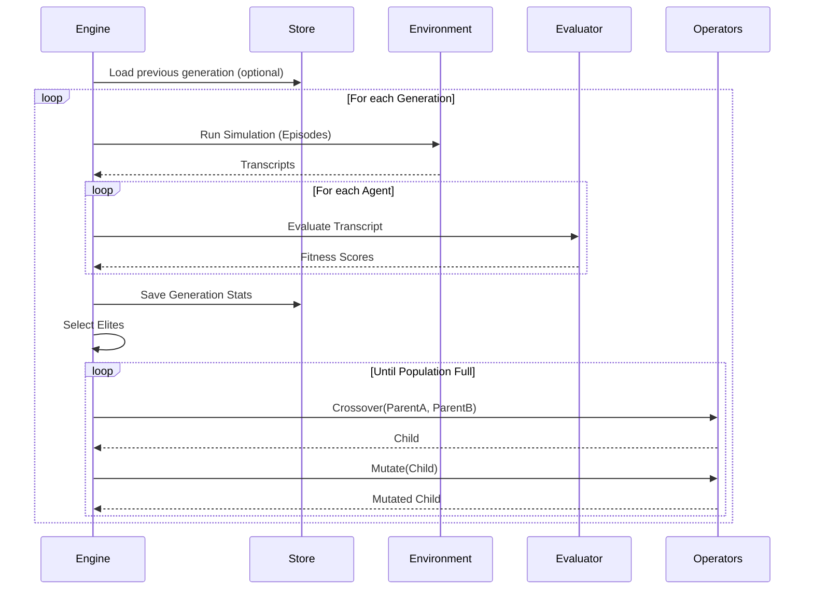
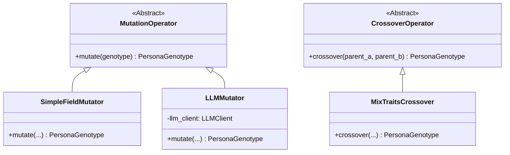

# Evolution Orchestrator: Engine & Operators

**Modules:** `snackPersona/orchestrator/engine.py`, `snackPersona/orchestrator/operators.py`

This module orchestrates the entire evolutionary process, managing the selection, crossover, and mutation of personas.

## Evolution Loop Sequence

## Operators Class Diagram

## Implementation Details

- **EvolutionEngine**: The core controller class. It initializes, evaluates, selects, and evolves the population.
- **MutationOperator**: Abstract base for mutation logic.
    - **SimpleFieldMutator**: Randomly perturbs fields.
    - **LLMMutator**: Uses LLM to create semantically meaningful mutations.
- **CrossoverOperator**: Abstract base for crossover logic.
    - **MixTraitsCrossover**: Randomly selects traits from two parents to form a child.
