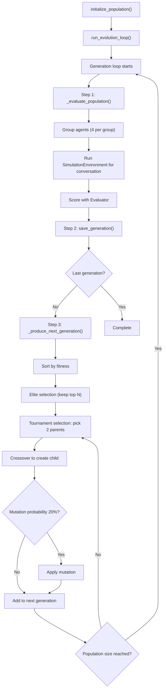
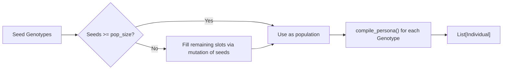
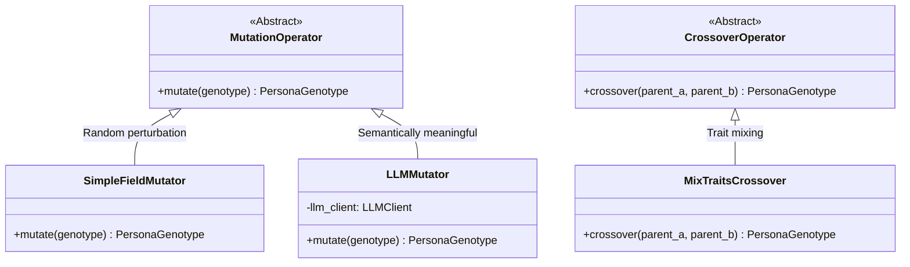
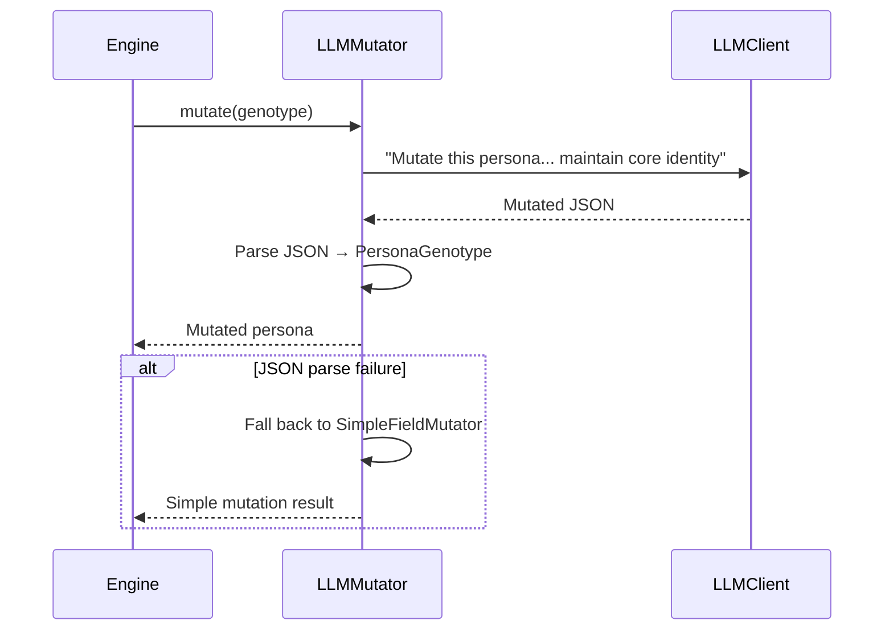
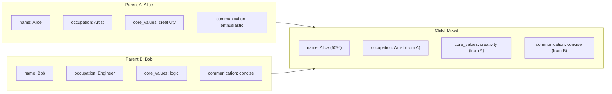

# Evolution Orchestrator — Engine & Genetic Operators

**Source files:** `snackPersona/orchestrator/engine.py`, `snackPersona/orchestrator/operators.py`

## Overview

The Orchestrator is the heart of the evolutionary algorithm. It consists of two files:

- **`engine.py`**: `EvolutionEngine` — controls the entire evolutionary loop
- **`operators.py`**: Mutation and Crossover genetic operators

## EvolutionEngine

### Full Evolution Loop



### Constructor Parameters

```python
engine = EvolutionEngine(
    llm_client=mock_client,        # LLM backend
    store=persona_store,           # Generation data storage
    evaluator=basic_evaluator,     # Evaluation engine
    mutation_op=simple_mutator,    # Mutation operator
    crossover_op=mix_crossover,    # Crossover operator
    population_size=10,            # Population size
    generations=5,                 # Number of generations
    elite_count=2                  # Number of elites to preserve
)
```

| Parameter | Type | Default | Description |
|---|---|---|---|
| `population_size` | `int` | `10` | Number of personas per generation |
| `generations` | `int` | `5` | Number of generations to evolve |
| `elite_count` | `int` | `2` | Top individuals carried over unchanged |

### Population Initialization Logic



### Selection Strategy

Currently uses **Tournament Selection (size 3)**:

1. Randomly sample 3 individuals from the population
2. Pick the one with the highest `engagement` score as a parent
3. Repeat to select a second parent (p1, p2)

**Fitness weighting:**
```python
# Currently uses a simple sum of engagement + conversation_quality for sorting
key = ind.scores.engagement + ind.scores.conversation_quality
```

## Genetic Operators

### Class Hierarchy



### SimpleFieldMutator (Simple Mutation)

Randomly selects one field and applies a small change:

| Mutation Type | Probability | Operation |
|---|---|---|
| `name` | 33% | Appends `" II"` to the name |
| `age` | 33% | Changes age by ±1 |
| `backstory` | 33% | Appends `"[Recently changed perspective.]"` to backstory |

```python
mutated = SimpleFieldMutator().mutate(alice_genotype)
# alice_genotype.name = "Alice" → mutated.name = "Alice II"
```

### LLMMutator (LLM-Based Mutation)

Sends the original persona JSON to an LLM and asks it to generate a "slightly different variation."



**Advantage:** Produces "meaningful" mutations — e.g., changing hobbies or slightly adjusting values, rather than just appending strings.

### MixTraitsCrossover (Trait-Mixing Crossover)

Selects field values from two parents, each with a 50% probability:



**Field assignment rules:**

| Field | Source | Selection |
|---|---|---|
| `name` | A or B | 50/50 random |
| `age` | A or B | 50/50 random |
| `occupation` | Always A | — |
| `backstory` | Always B | — |
| `core_values` | Always A | — |
| `hobbies` | Always B | — |
| `personality_traits` | Always A | — |
| `communication_style` | Always B | — |
| `topical_focus` | Always A | — |
| `interaction_policy` | Always B | — |
| `goals` | First half of A + second half of B | List merge |

## Evolution Walkthrough (Example: 3 generations, 4 personas)

```
Generation 0: [Alice, Bob, Charlie, Dana]
  ↓ Simulation & Evaluation
  ↓ Alice=0.9, Dana=0.7, Bob=0.5, Charlie=0.3
  ↓ Elites: Alice, Dana preserved
  ↓ Crossover: Alice×Dana → Child1, Bob×Alice → Child2
  ↓ Mutation: Child2 mutated with 20% probability

Generation 1: [Alice, Dana, Child1, Child2(mutated)]
  ↓ Simulation & Evaluation
  ↓ Child1=0.95, Alice=0.85, Child2=0.6, Dana=0.55
  ↓ Elites: Child1, Alice preserved
  ...

Generation 2: [Child1, Alice, Grandchild1, Grandchild2]
  ↓ Saved as final generation
```

## Extension Points

- **Multi-objective selection**: Replace simple sum with Pareto-optimal selection (e.g., NSGA-II)
- **Adaptive mutation rate**: Decrease mutation rate as generations progress
- **LLM crossover**: Use an LLM for semantically meaningful crossover (like `LLMMutator`)
- **Island model**: Evolve multiple populations in parallel and periodically exchange individuals
