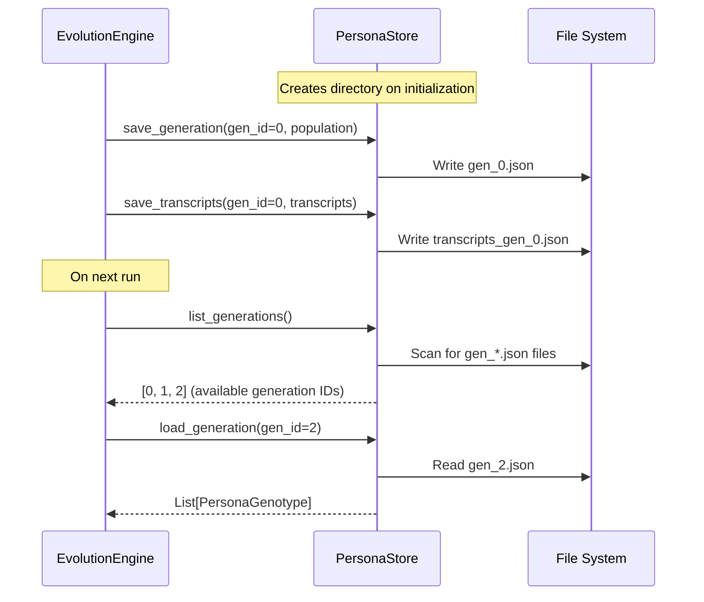

# Persona Store — Generation Data Persistence

**Source file:** `snackPersona/persona_store/store.py`

## Overview

The Persona Store saves and loads each generation's persona population and conversation transcripts as JSON files on disk. This enables pausing and resuming evolution runs, as well as analyzing past generations and their conversations.

## File Structure

```
persona_data/                      ← store_dir
├── gen_0.json                     ← Generation 0 population
├── gen_1.json                     ← Generation 1 population
├── transcripts_gen_0.json         ← Generation 0 conversation logs
├── transcripts_gen_1.json         ← Generation 1 conversation logs
├── generation_stats.jsonl         ← Per-generation fitness statistics
└── plots/                         ← Visualisation output
    ├── fitness_curves.png
    └── ...
```

## Data Flow



## API Reference

### `PersonaStore.__init__(storage_dir: str)`

Initializes with a storage directory path. Creates the directory if it doesn't exist.

### `save_generation(generation_id: int, population: List[PersonaGenotype])`

Serializes the persona population to JSON and saves it with file locking.

```python
store = PersonaStore("persona_data")
store.save_generation(0, [genotype_alice, genotype_bob])
# → persona_data/gen_0.json
```

### `save_transcripts(generation_id: int, transcripts: List[List[dict]])`

Saves conversation transcripts for a generation. Each entry is one group episode's full transcript.

```python
store.save_transcripts(0, [transcript_group_0, transcript_group_1])
# → persona_data/transcripts_gen_0.json
```

### `load_generation(generation_id: int) -> List[PersonaGenotype]`

Loads the population for the specified generation. Returns an empty list if the file doesn't exist.

### `list_generations() -> List[int]`

Returns a sorted list of all saved generation IDs.

## Transcript JSON Example

```json
[
  [
    {"type": "post", "author": "PixelForge", "content": "Here's my take on..."},
    {"type": "reply", "author": "DataNinja", "target_author": "PixelForge", "content": "Interesting! I think..."},
    {"type": "pass", "author": "EcoSage", "target_author": "PixelForge"}
  ]
]
```

## Design Decisions

- **Why JSON?**: Human-readable, easy to debug, Git-friendly diffs
- **Why one file per generation?**: Per-generation files match the natural access pattern and keep file sizes manageable
- **Transcript preservation**: Full conversation logs enable post-hoc analysis of discussion quality and persona behavior
- **File locking**: `filelock.FileLock` ensures safe concurrent access to generation files

## Extension Points

- **Database backend**: Swap in SQLite or MongoDB for large-scale data
- **Transcript search**: Full-text search over conversation history
- **Metadata**: Store per-generation score statistics alongside the population
- **Versioning**: Include timestamps in filenames or manage via Git
