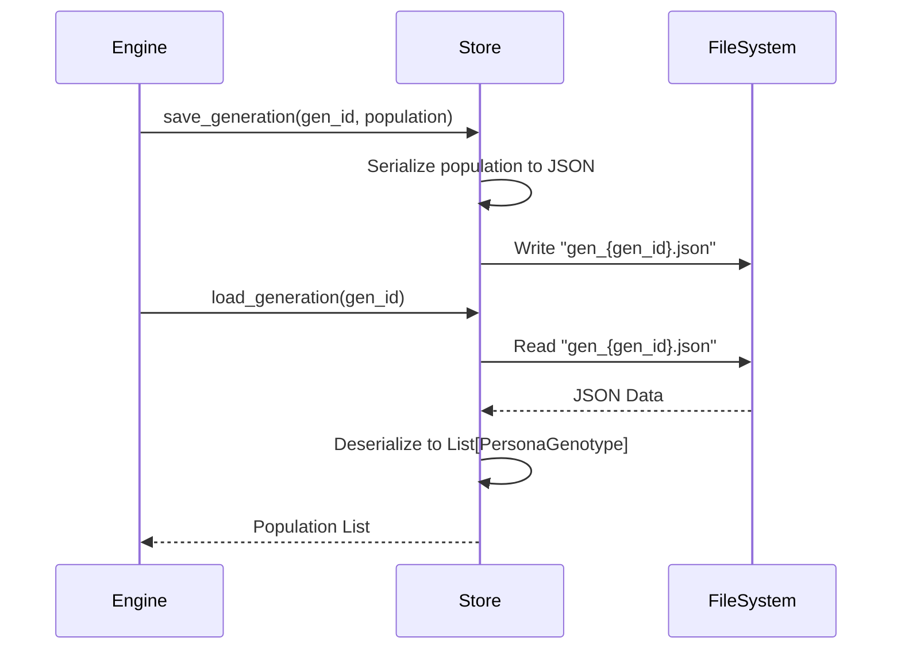

# Persona Store

**Module:** `snackPersona/persona_store/store.py`

This module handles the persistence of persona data (genotypes). It saves and loads generations of personas to/from JSON files in a specified directory.

## Sequence Diagram (Save/Load)

## Implementation Details

- **PersonaStore Class**: The main class for storage operations.
- **Storage Strategy**:
    - Each generation is saved as a separate JSON file (`gen_X.json`).
    - The file contains a list of serialized `PersonaGenotype` objects.
- **Dependencies**: Requires `snackPersona.utils.data_models` for `PersonaGenotype` deserialization.
