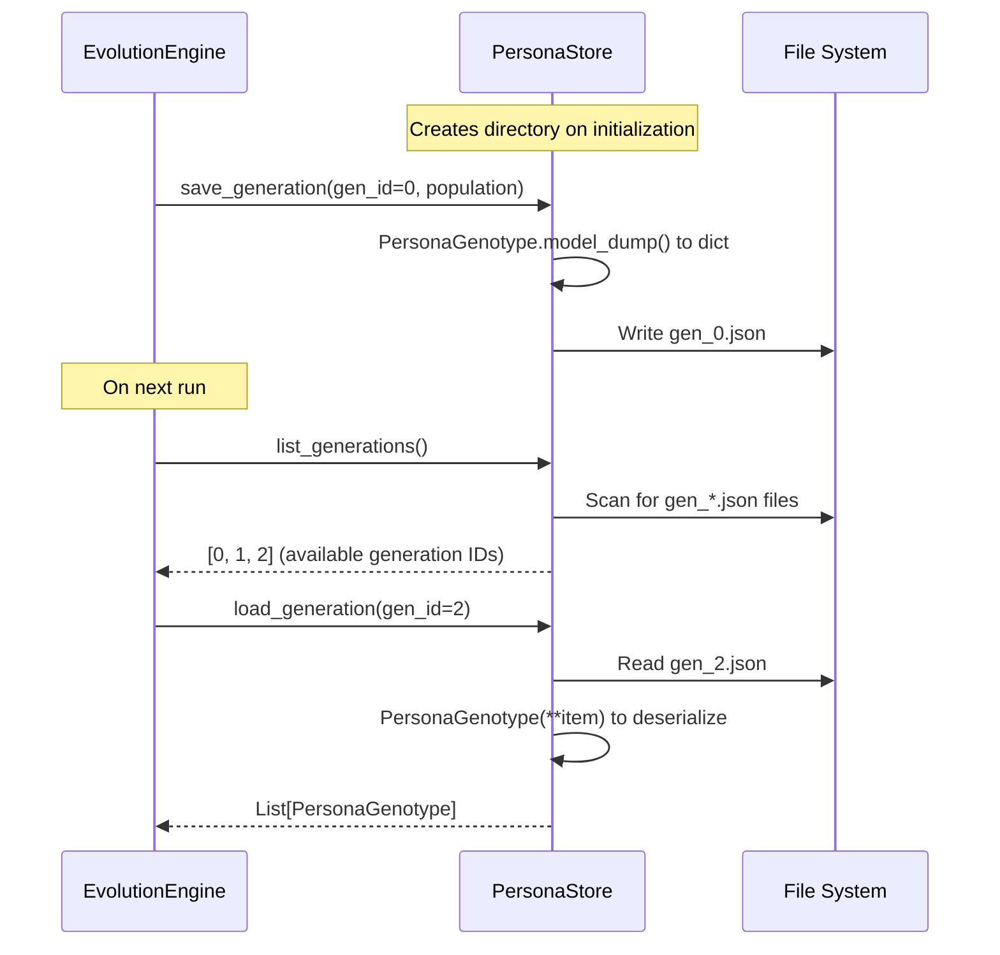

# Persona Store — Generation Data Persistence

**Source file:** `snackPersona/persona_store/store.py`

## Overview

The Persona Store saves and loads each generation's persona population as JSON files on disk. This enables pausing and resuming evolution runs, as well as analyzing past generations.

## File Structure

```
persona_data/           ← store_dir
├── gen_0.json          ← Generation 0 population
├── gen_1.json          ← Generation 1 population
├── gen_2.json          ← Generation 2 population
└── ...
```

Each file contains a JSON-serialized list of `PersonaGenotype` objects.

## Data Flow



## API Reference

### `PersonaStore.__init__(storage_dir: str)`

Initializes with a storage directory path. Creates the directory if it doesn't exist.

### `save_generation(generation_id: int, population: List[PersonaGenotype])`

Serializes the persona population to JSON and saves it.

```python
store = PersonaStore("persona_data")
store.save_generation(0, [genotype_alice, genotype_bob])
# → persona_data/gen_0.json is created
```

### `load_generation(generation_id: int) -> List[PersonaGenotype]`

Loads the population for the specified generation. Returns an empty list if the file doesn't exist.

```python
population = store.load_generation(0)
print(population[0].name)  # "Alice"
```

### `list_generations() -> List[int]`

Returns a sorted list of all saved generation IDs.

```python
print(store.list_generations())  # [0, 1, 2]
```

## JSON File Example

```json
[
  {
    "name": "Alice",
    "age": 25,
    "occupation": "Digital Artist",
    "backstory": "Always loved drawing, now exploring generative art.",
    "core_values": ["creativity", "freedom"],
    "hobbies": ["sketching", "visiting galleries"],
    "personality_traits": {"openness": 0.9, "neuroticism": 0.4},
    "communication_style": "enthusiastic and visual",
    "topical_focus": "digital art trends",
    "interaction_policy": "compliment others' work",
    "goals": ["become famous", "inspire others"]
  },
  {
    "name": "Bob",
    "age": 35,
    "occupation": "Software Engineer",
    ...
  }
]
```

## Design Decisions

- **Why JSON?**: Human-readable, easy to debug, Git-friendly diffs
- **Why one file per generation?**: A single monolithic file would grow too large. Per-generation files match the natural access pattern
- **Pydantic integration**: `model_dump()` and `PersonaGenotype(**data)` provide type-safe serialization/deserialization

## Extension Points

- **Database backend**: Swap in SQLite or MongoDB for large-scale data
- **Metadata**: Store per-generation score statistics alongside the population
- **Versioning**: Include timestamps in filenames or manage via Git
