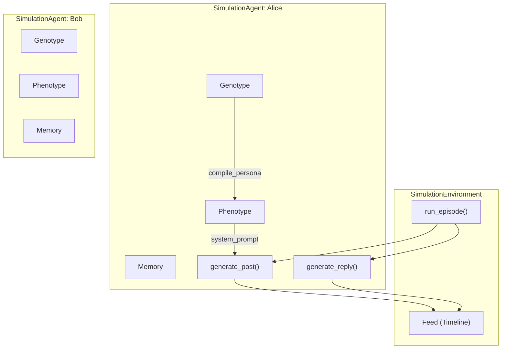
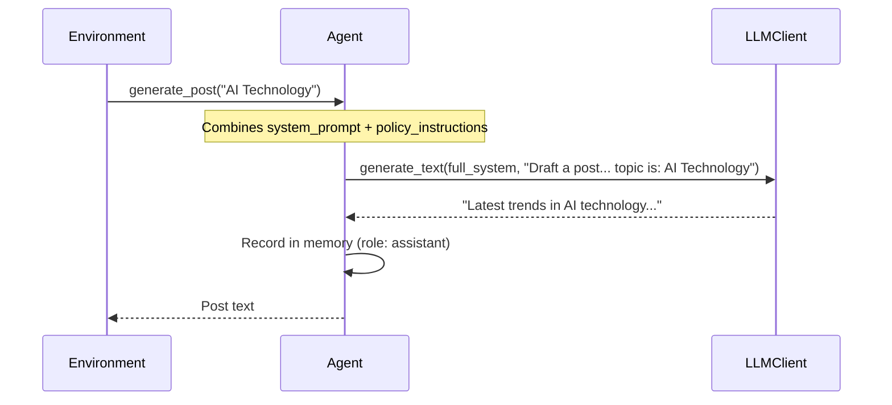
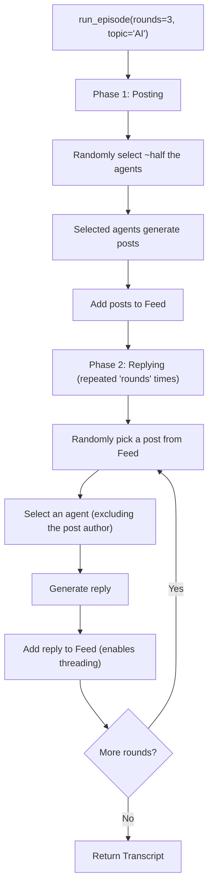

# Simulation — SNS Agent Simulation

**Source files:** `snackPersona/simulation/agent.py`, `snackPersona/simulation/environment.py`

## Overview

The Simulation module simulates how AI personas behave on a social network. Each persona is wrapped as a `SimulationAgent`, and a `SimulationEnvironment` manages the shared feed (timeline) where agents post and reply.

The output of this module (Transcript = conversation log) is passed to the evaluation engine for persona quality scoring.

## Architecture



## SimulationAgent Details

### Initialization

```python
agent = SimulationAgent(genotype=alice_genotype, llm_client=mock_client)
# Internally calls compile_persona(genotype) to produce the Phenotype
```

### `generate_post(topic: str) -> str`

Generates an SNS post based on a topic.



**Prompt structure:**
```
[system_prompt]          ← Persona identity
[policy_instructions]    ← Behavioral rules
---
[user_prompt]            ← "Draft a new post... The current trending topic is: {topic}"
```

### `generate_reply(post_content: str, author_name: str) -> str`

Generates a reply to another agent's post.

**Prompt structure:**
```
[system_prompt + policy_instructions]
---
User '{author_name}' posted: "{post_content}"
Write a reply.
```

### Memory (Short-Term)

During each episode, agents accumulate their actions in a `memory` list. It is cleared via `reset_memory()` at the end of each episode.

```python
agent.memory = [
    {"role": "assistant", "content": "My first post..."},
    {"role": "user", "content": "Bob: Great post!"},
    {"role": "assistant", "content": "Thanks Bob!"},
]
```

> **Note**: The current implementation does not include memory in the LLM prompt. In the future, feeding it into the context window would enable more consistent conversations.

## SimulationEnvironment Details

### Episode Flow



### Transcript (Output) Structure

`run_episode()` returns a `List[Dict]` transcript:

```python
transcript = [
    {
        "type": "post",
        "author": "Alice",
        "content": "Thinking about the latest AI trends..."
    },
    {
        "type": "reply",
        "author": "Bob",
        "target_author": "Alice",
        "content": "Interesting perspective! Especially...",
        "reply_to": "Thinking about the latest AI trends..."
    }
]
```

| Field | Type | Description |
|---|---|---|
| `type` | `str` | `"post"` or `"reply"` |
| `author` | `str` | Persona name of the speaker |
| `content` | `str` | Post/reply text |
| `target_author` | `str` | Name of the persona being replied to (reply only) |
| `reply_to` | `str` | Text of the original post (reply only) |

## Design Decisions

- **Random selection**: Posters and repliers are chosen randomly, producing diverse interaction patterns
- **Flat feed**: All events live in a single list. Thread-like structures are a future enhancement
- **Episode-based**: 1 episode = posts + replies on a single topic. Multiple episodes per generation can be run

## Extension Points

- **Thread structure**: Manage replies as a tree for more natural conversation flow
- **Memory utilization**: Include agent memory in LLM prompts to maintain conversational context
- **Reactions**: Add "like," "retweet," and other social actions
- **Topic diversification**: Run episodes on multiple topics to evaluate persona breadth
