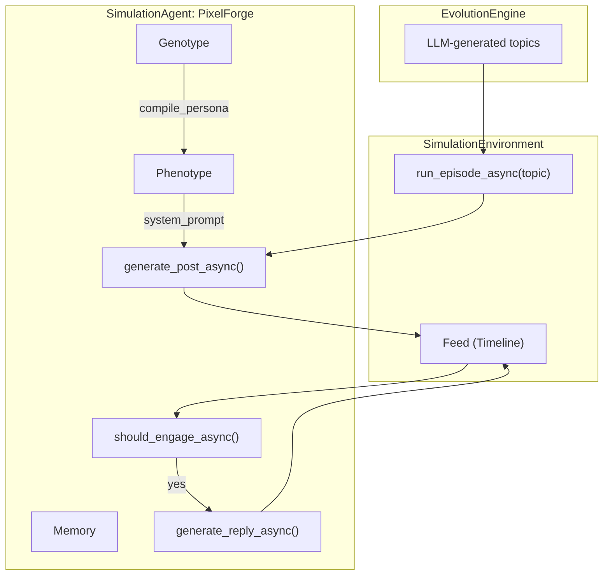
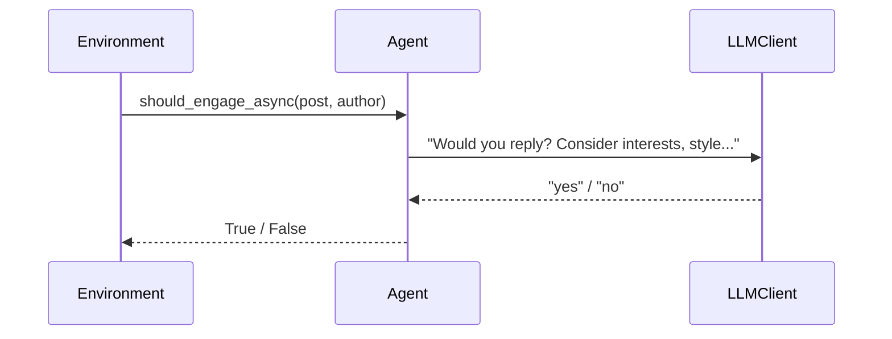
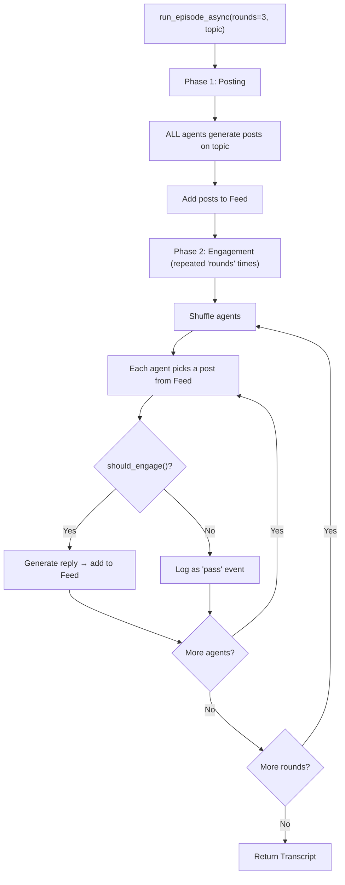

# Simulation — SNS Agent Simulation

**Source files:** `simulation/agent.py`, `simulation/environment.py`

## Overview

The Simulation module simulates how AI personas behave on a social network. Each persona is wrapped as a `SimulationAgent`, and a `SimulationEnvironment` manages the shared feed where agents post, decide whether to engage, and reply.

Topics for each episode are provided by the `EvolutionEngine` via LLM-driven topic generation. The output (Transcript) is passed to the evaluation engine for fitness scoring and saved to disk for analysis.

## Architecture



## SimulationAgent

### Key Methods

| Method | Purpose |
|---|---|
| `generate_post(topic)` / `generate_post_async(topic)` | Creates a new SNS post based on persona and topic |
| `should_engage(post, author)` / `should_engage_async(...)` | **LLM-based decision**: "Would this persona reply?" Returns `True`/`False` |
| `generate_reply(post, author)` / `generate_reply_async(...)` | Generates a reply to another agent's post |
| `generate_media_reaction(media_item)` | Reacts to an article/media content |

### `should_engage()` — Persona-Driven Engagement

The agent uses the LLM to decide whether its persona would reply, considering:
- **Topical interest** (`topical_focus`)
- **Interaction style** (`interaction_policy`)
- **Content relevance**



All actions are logged via structured logger (`utils/logger.py`).

## SimulationEnvironment

### Episode Flow (Persona-Driven)



### Transcript Structure

```python
transcript = [
    {"type": "post", "author": "PixelForge", "content": "..."},
    {"type": "reply", "author": "DataNinja", "target_author": "PixelForge",
     "content": "...", "reply_to": "..."},
    {"type": "pass", "author": "EcoSage", "target_author": "PixelForge"}
]
```

| Type | Fields | Description |
|---|---|---|
| `post` | `author`, `content` | Agent's initial post |
| `reply` | `author`, `target_author`, `content`, `reply_to` | Agent's reply to another post |
| `pass` | `author`, `target_author` | Agent decided NOT to engage |

## Design Decisions

- **LLM-driven topics**: Topics are generated per generation by the engine, not hardcoded
- **Persona-driven engagement**: Agents use LLM to decide whether to reply, producing more realistic interaction patterns
- **Pass events in transcript**: Logged so evaluators can measure selectivity and engagement quality
- **All-post-first**: Every agent posts before any replies begin, ensuring a rich feed for engagement decisions
- **Feed reset**: Feed is cleared between group episodes to prevent cross-contamination

## Extension Points

- **Thread structure**: Manage replies as a tree for natural conversation flow
- **Memory in prompts**: Feed agent memory into LLM context for more consistent conversations
- **Reactions**: Add "like," "retweet," and other social actions
- **Multi-turn topics**: Let topics evolve within an episode
