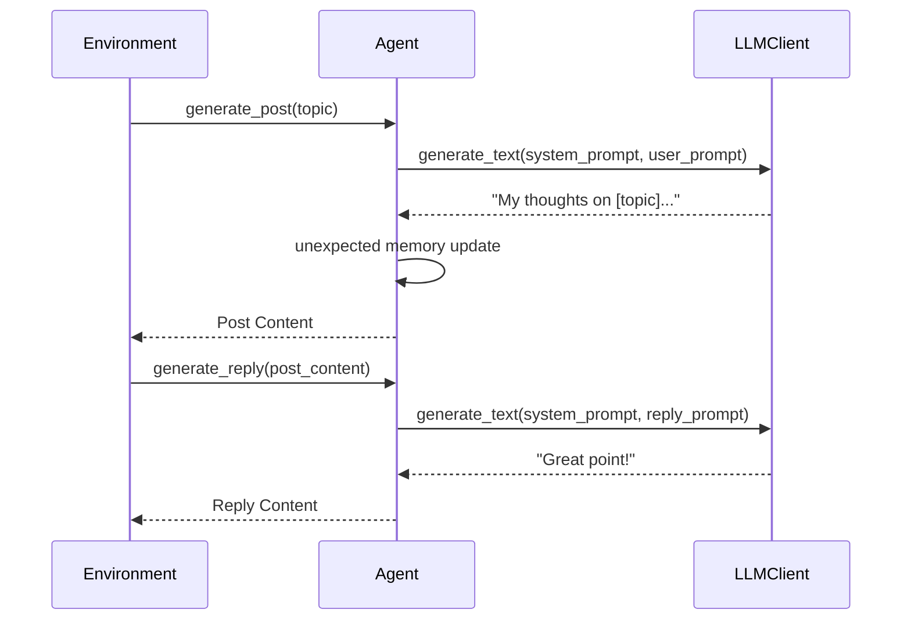
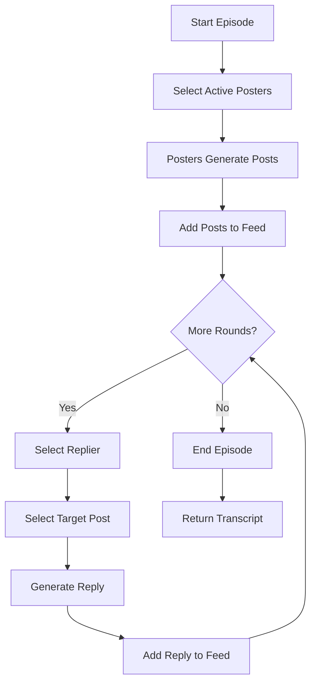

# Simulation: Environment & Agents

**Modules:** `snackPersona/simulation/agent.py`, `snackPersona/simulation/environment.py`

This module manages the SNS simulation, handling the interactions between agents. It encapsulates the persona (genotype), the compiled prompt (phenotype), and orchestrates rounds of posting and replying to create conversation threads.

## Agent Interaction Sequence

## Simulation Episode Flow

## Implementation Details

- **SimulationAgent**:
    - Wraps a `PersonaGenotype` and compiles it into a `PersonaPhenotype`.
    - Holds a reference to the `LLMClient`.
    - Maintains a short-term memory of its own actions and relevant context.
- **SimulationEnvironment**:
    - Holds a list of active `SimulationAgent` instances.
    - Manages the global `feed` (list of events).
    - Exposes `run_episode` to execute a round of simulation based on a topic.
