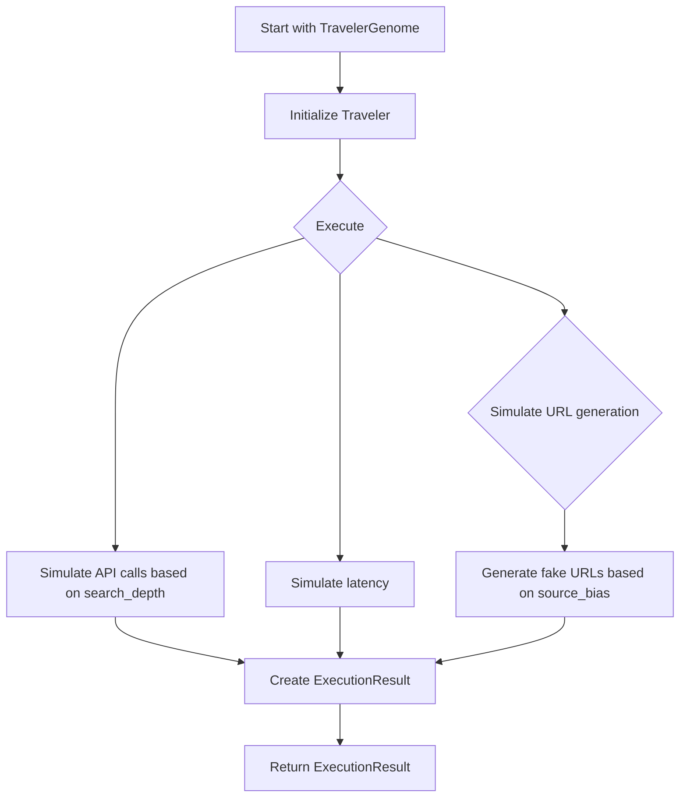

## Executor Component

```mermaid
graph TD
    A[Start with TravelerGenome] --> B[Initialize Traveler];
    B --> C{Execute};
    C --> D[Simulate API calls based on search_depth];
    C --> E[Simulate latency];
    C --> F{Simulate URL generation};
    F --> G[Generate fake URLs based on source_bias];
    D & E & G --> H[Create ExecutionResult];
    H --> I[Return ExecutionResult];
```
