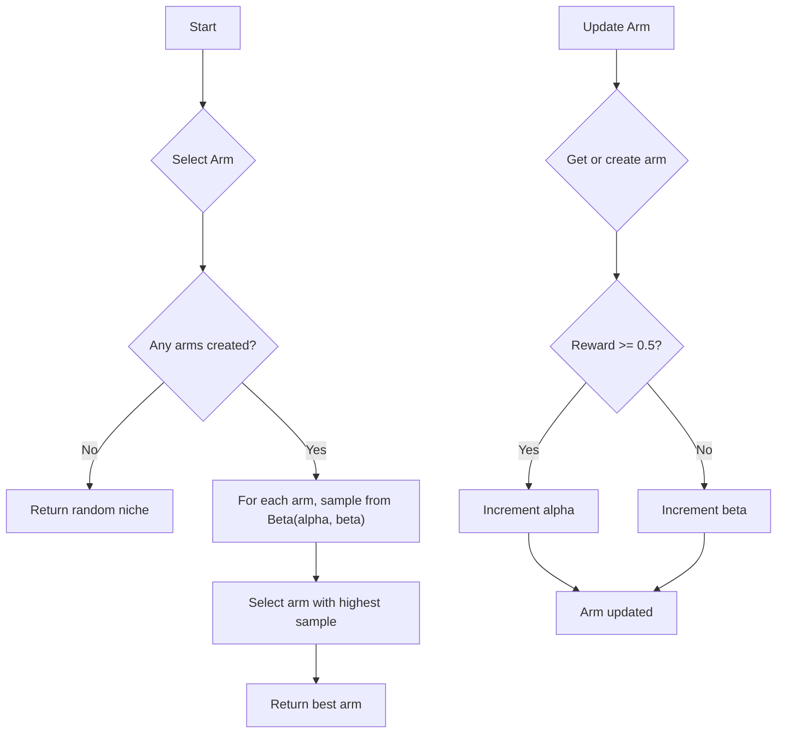

## Bandit Component

```mermaid
graph TD
    A[Start] --> B{Select Arm};
    B --> C{Any arms created?};
    C -- No --> D[Return random niche];
    C -- Yes --> E["For each arm, sample from Beta(alpha, beta)"];
    E --> F[Select arm with highest sample];
    F --> G[Return best arm];
    
    H[Update Arm] --> I{Get or create arm};
    I --> J{Reward >= 0.5?};
    J -- Yes --> K[Increment alpha];
    J -- No --> L[Increment beta];
    K --> M[Arm updated];
    L --> M;
```
