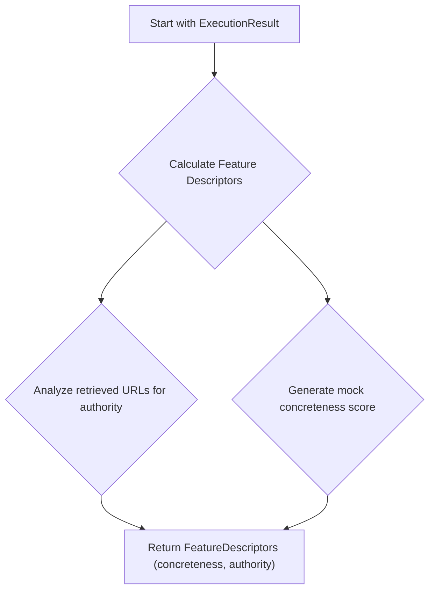
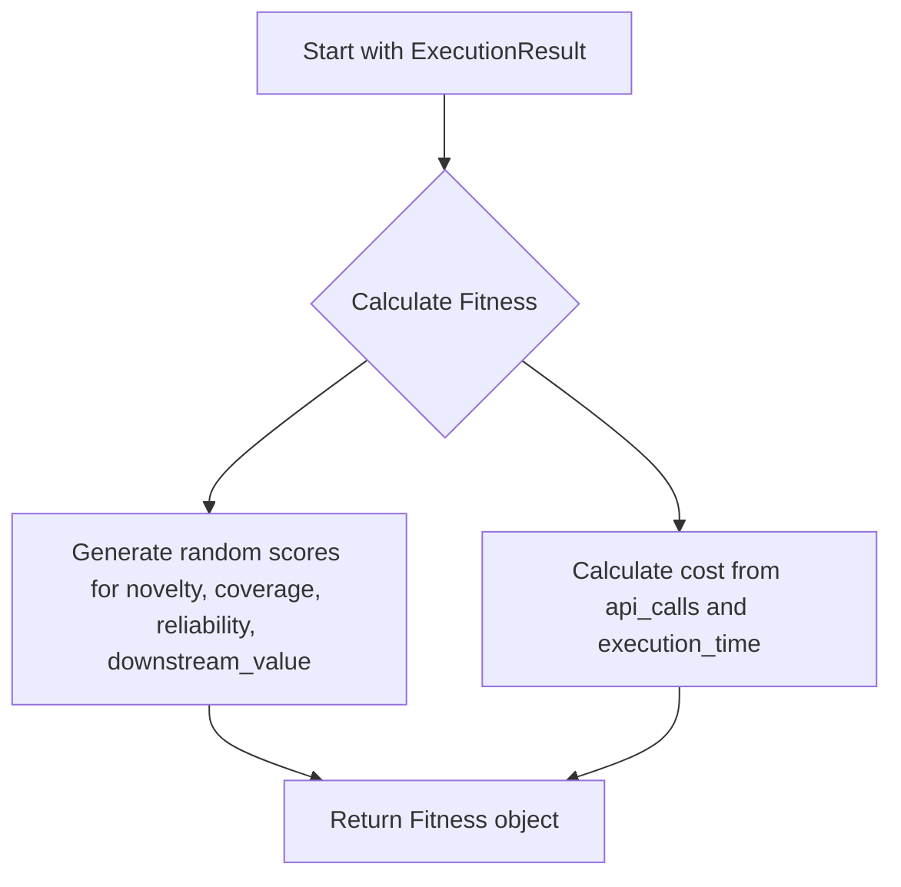
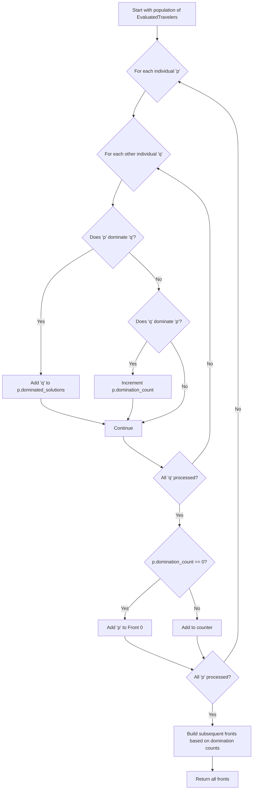

## Evaluation Component

### Feature Calculation

```mermaid
graph TD
    A[Start with ExecutionResult] --> B{Calculate Feature Descriptors};
    B --> C{Analyze retrieved URLs for authority};
    B --> D{Generate mock concreteness score};
    C & D --> E["Return FeatureDescriptors (concreteness, authority)"];
```

### Fitness Calculation

```mermaid
graph TD
    A[Start with ExecutionResult] --> B{Calculate Fitness};
    B --> C[Generate random scores for novelty, coverage, reliability, downstream_value];
    B --> D[Calculate cost from api_calls and execution_time];
    C & D --> E[Return Fitness object];
```

### Non-Dominated Sort (NSGA-II)

```mermaid
graph TD
    A[Start with population of EvaluatedTravelers] --> B{For each individual 'p'};
    B --> C{For each other individual 'q'};
    C --> D{Does 'p' dominate 'q'?};
    D -- Yes --> E[Add 'q' to p.dominated_solutions];
    D -- No --> F{Does 'q' dominate 'p'?};
    F -- Yes --> G[Increment p.domination_count];
    F -- No --> H[Continue];
    E --> H;
    G --> H;
    H --> I{All 'q' processed?};
    I -- No --> C;
    I -- Yes --> J{p.domination_count == 0?};
    J -- Yes --> K[Add 'p' to Front 0];
    J -- No --> L[Add to counter];
    K --> M{All 'p' processed?};
    L --> M;
    M -- No --> B;
    M -- Yes --> N[Build subsequent fronts based on domination counts];
    N --> O[Return all fronts];
```
