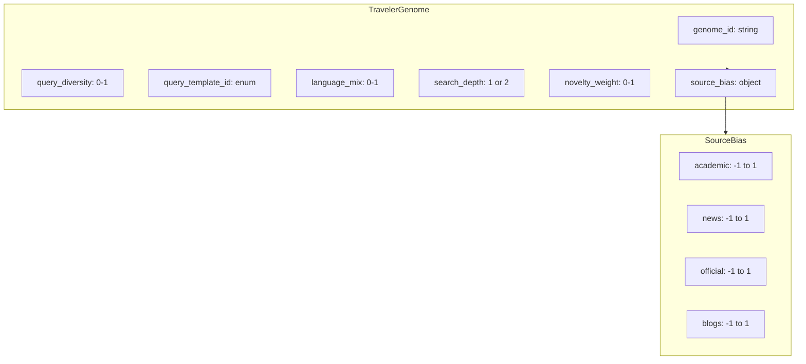

## Genomes Component (Data Structure)

```mermaid
graph TD
    subgraph TravelerGenome
        A["genome_id: string"]
        B["query_diversity: 0-1"]
        C["query_template_id: enum"]
        D["language_mix: 0-1"]
        E["search_depth: 1 or 2"]
        F["novelty_weight: 0-1"]
        G["source_bias: object"]
    end

    subgraph SourceBias
        H["academic: -1 to 1"]
        I["news: -1 to 1"]
        J["official: -1 to 1"]
        K["blogs: -1 to 1"]
    end

    TravelerGenome --> G
    G --> SourceBias
```
