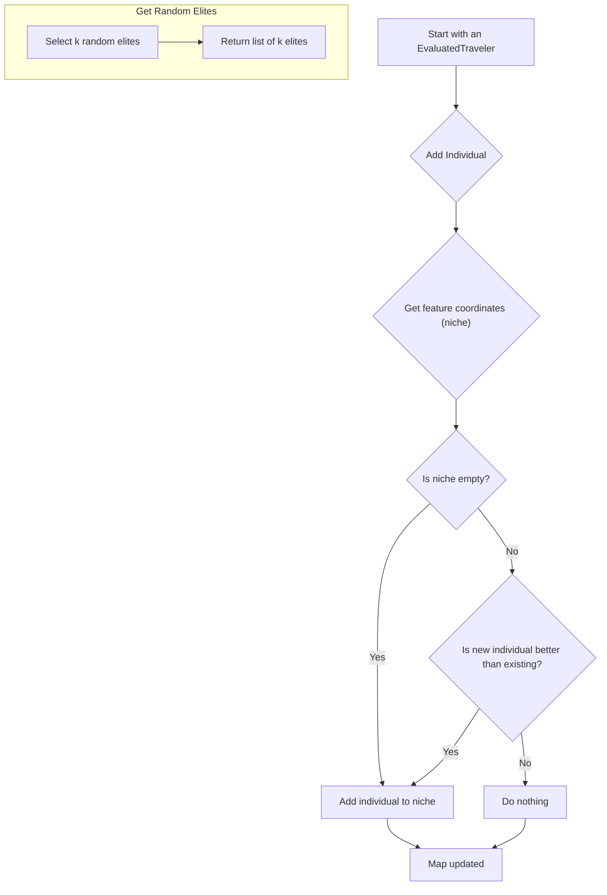

## MAP-Elites Component

```mermaid
graph TD
    A[Start with an EvaluatedTraveler] --> B{Add Individual};
    B --> C{"Get feature coordinates (niche)"};
    C --> D{Is niche empty?};
    D -- Yes --> E[Add individual to niche];
    D -- No --> F{Is new individual better than existing?};
    F -- Yes --> E;
    F -- No --> G[Do nothing];
    E --> H[Map updated];
    G --> H;

    subgraph "Get Random Elites"
        J[Select k random elites] --> K[Return list of k elites];
    end
```
