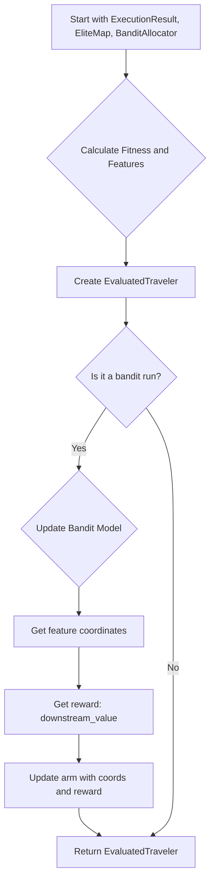
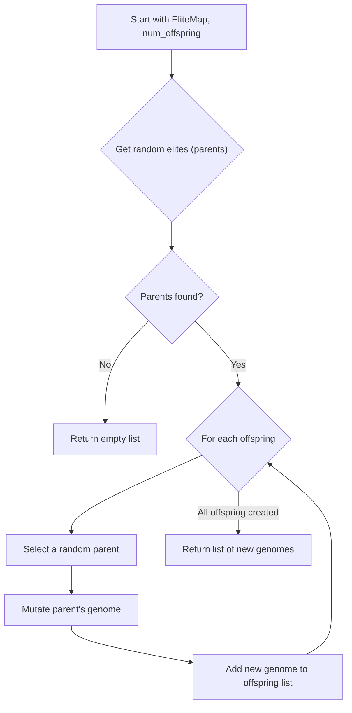
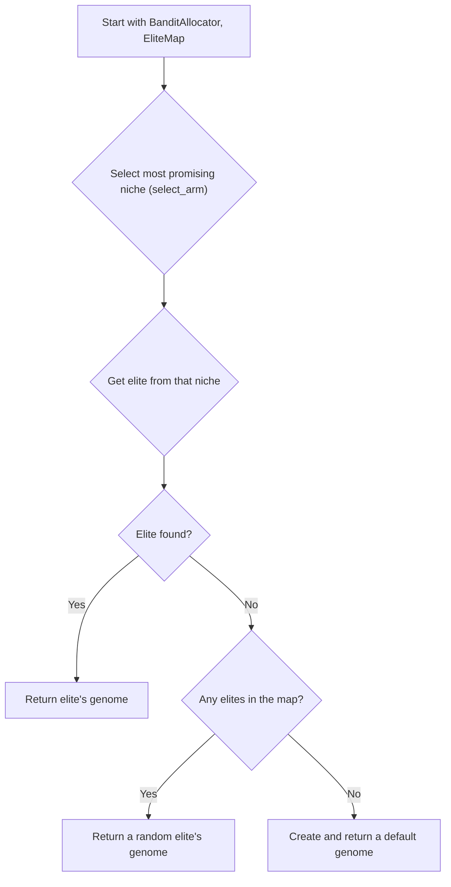

## Services Component

### Evaluation and Map Management Handler

```mermaid
graph TD
    A["Start with ExecutionResult, EliteMap, BanditAllocator"] --> B{Calculate Fitness and Features};
    B --> C[Create EvaluatedTraveler];
    C --> D{Is it a bandit run?};
    D -- Yes --> E{Update Bandit Model};
    E --> F[Get feature coordinates];
    F --> G["Get reward: downstream_value"];
    G --> H[Update arm with coords and reward];
    H --> I[Return EvaluatedTraveler];
    D -- No --> I;
```

### Generation Scheduler Handler

```mermaid
graph TD
    A[Start with EliteMap, num_offspring] --> B{"Get random elites (parents)"};
    B --> C{Parents found?};
    C -- No --> D[Return empty list];
    C -- Yes --> E{For each offspring};
    E --> F[Select a random parent];
    F --> G[Mutate parent's genome];
    G --> H[Add new genome to offspring list];
    H --> E;
    E -- All offspring created --> I[Return list of new genomes];
```

### Bandit Allocator Handler

```mermaid
graph TD
    A[Start with BanditAllocator, EliteMap] --> B{"Select most promising niche (select_arm)"};
    B --> C{Get elite from that niche};
    C --> D{Elite found?};
    D -- Yes --> E[Return elite's genome];
    D -- No --> F{Any elites in the map?};
    F -- Yes --> G[Return a random elite's genome];
    F -- No --> H[Create and return a default genome];
```
