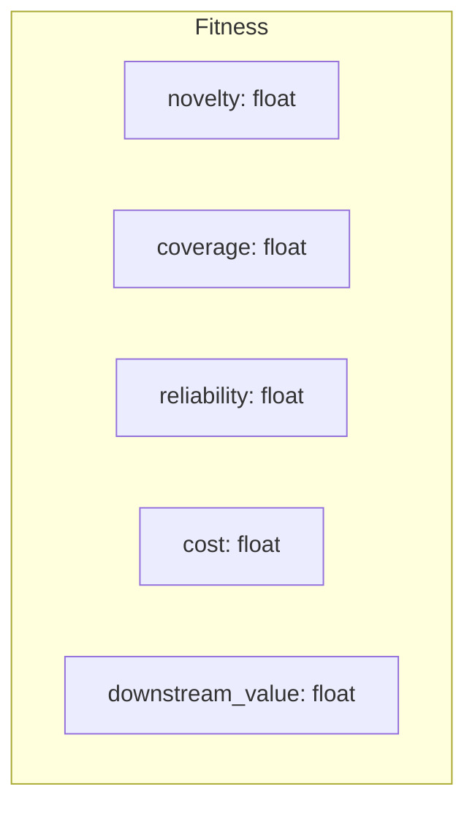
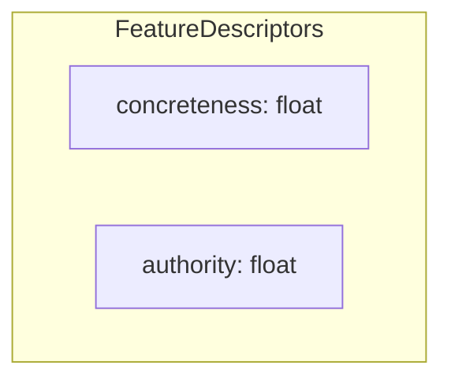
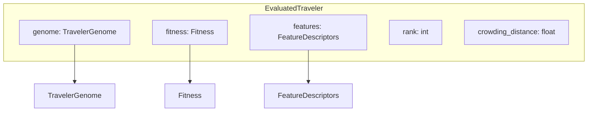

## Utils Component (Data Models)

### ExecutionResult
```mermaid
graph TD
    subgraph ExecutionResult
        A[genome_id: string]
        B[retrieved_urls: List[string]]
        C[generated_queries: List[string]]
        D[log: string]
        E[api_calls: int]
        F[execution_time: float]
    end
```

### Fitness


### FeatureDescriptors


### EvaluatedTraveler

